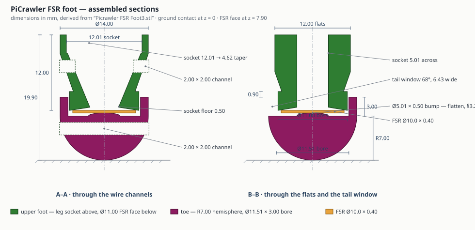

# PiCrawler FSR foot — the printed foot/toe mod

> **The official record of the foot modification.** Source geometry, derived dimensions,
> assembly order, and the constants this changes. The *rationale* for having foot load at
> all lives in [`../plans-and-designs/picrawler_sim2real_port.md`](../plans-and-designs/picrawler_sim2real_port.md)
> `## SPEC — foot FSRs`; the wiring and calibration half lives in
> [`picrawler_sensor_wiring_and_bom.md`](picrawler_sensor_wiring_and_bom.md) §5.
> **This file is the mechanical half, and it supersedes that spec's "Mounting" section.**

**Status, 2026-09-27: parts printed and the fit measured good; not yet assembled.** The one
open design question is the bump's face — §3.2. Everything below the
"Derived geometry" heading is measured off the CAD; everything under "Open at the bench" is not.

## Source files

| file | what it is |
|---|---|
| [`../plans-and-designs/CAD/Picrawler/Picrawler FSR Foot3.stl`](../plans-and-designs/CAD/Picrawler/Picrawler%20FSR%20Foot3.stl) | both parts, in **print orientation** — the upper foot sits upside down beside the toe |
| `../plans-and-designs/CAD/Picrawler/picrawler_toe1–4.png` | CAD views of the assembled pair |
| [`../plans-and-designs/CAD/Picrawler/picrawler_fsr_foot_section.svg`](../plans-and-designs/CAD/Picrawler/picrawler_fsr_foot_section.svg) | the two sections below, drawn to scale from the STL |

**Print material: UV resin, solid.** Printed volume is 843.3 mm³ (upper foot) + 783.0 mm³
(toe) = **1626.3 mm³**, which at a cured density of 1.10–1.20 g/cm³ gives 1.79–1.95 g. With
the sensor that lands at 2.0–2.2 g against the operator's ~2 g bench figure, so the parts are
printed as designed with no unrecorded cavity.

**How the numbers were derived.** The STL is binary, 3434 triangles, three closed shells (the
upper foot exports as two stacked solids). Dimensions below come from slicing the mesh at
0.2 mm intervals and taking edge crossings along each part's centre lines, so they are the
model's numbers rather than a reading off a screen. Anything a slicer cannot see — fit,
insertion depth, glue thickness — is in "Open at the bench".

---

## 1. The assembly

Four parts per foot, bottom to top: **toe** (hemisphere, contacts the ground), **FSR**,
**upper foot** (carries the sensor face and the leg socket), **the lower leg** glued into it.

The toe is not fastened. It is held against the upper foot by a wire looped through a
2.00 × 2.00 mm channel in each part, and it floats on 0.25 mm of radial clearance. Force
arrives at the sensor through a single moulded bump on the toe's inner floor.



### 1.1 Upper foot

Heights are `h`, measured up from the FSR face, which is the part's lowest surface.

| feature | dimension |
|---|---|
| overall height | **12.00** |
| **FSR face** | **Ø11.00**, flat, a true circle (measured round to ±0.003) |
| boss — the part that enters the toe | Ø11.00 × 3.00 tall, `h` 0 → 3.00 |
| shoulder at `h` = 3.00 | steps out from Ø9.80 to Ø11.00 — **0.60 mm of radial ledge** |
| cone | Ø9.80 → Ø14.00 over `h` 3.00 → 9.00 (19.3° from the axis) |
| collar | Ø14.00, cut by two flats **12.00 across**, `h` 9.00 → 12.00; the flats first appear at `h` = 6.14 |
| **leg socket** | blind pocket, mouth at `h` = 12.00, floor at `h` = 0.50 → **11.50 deep** |
| socket width, across the flats | **5.01, constant** the whole depth — this is what locates the leg |
| socket width, the other axis | 12.01 down to `h` ≈ 9.2, then a linear taper: **W = 4.14 + 0.828·h** |
| socket floor | **0.50 thick** |
| **wire channel** | 2.00 × 2.00 through-slot, `h` 6.00 → 8.00, **opening into the leg socket** |

The socket is a wedge, not a parallel bore. Across the flats it is a constant 5.01 mm slip
fit; on the other axis it closes at 0.828 mm per mm of depth, from 12.01 mm at the mouth to
4.62 mm at the floor. **Insertion depth is therefore set by the leg, not by the part** —
see §4.

### 1.2 Toe

| feature | dimension |
|---|---|
| **ground contact** | **hemisphere, R7.00**, centre on the axis 7.00 above the contact point |
| bore | **Ø11.51 × 3.00 deep**, wall 1.25 |
| **FSR bump** | spherical cap, **Ø5.01 base × 0.50 tall**, centred on the bore floor |
| **tail window** | **68° of the bore wall removed**, full 3.00 height, **6.43 wide** at the bore |
| wire channel | 2.00 × 2.00 through-slot, 4.00 → 6.00 above the contact point |
| outer diameter at the rim | Ø14.00 |

The 68° window is the FSR tail's only way out of the joint, and it is a clean one: the wall
is gone across its whole height, so the tail leaves at sensor level without being pinched
between the boss and the bore.

### 1.3 The assembled stack

Measured from the ground contact point, with the FSR at its 0.40 mm thickness.

| height | what is there |
|---|---|
| 0 | ground contact |
| 7.00 | sphere centre, and the bore floor |
| 7.50 | bump apex |
| 7.50 → 7.90 | **the FSR** |
| 7.90 | the upper foot's Ø11.00 face |
| 8.40 | socket floor |
| 10.00 | toe rim |
| 10.90 | the upper foot's shoulder — **0.90 mm clear of the rim** |
| 4.00 → 6.00 | toe wire channel |
| 13.90 → 15.90 | upper-foot wire channel — **9.90 above the toe's** |
| **19.90** | socket mouth |

The two channels are 9.90 mm apart on purpose: the wire loops over the outside of the cone
rather than passing straight through, which is what pulls the toe up against the sensor.

---

## 2. The load path, and what carries what

Ground → toe hemisphere → **Ø5.01 bump** → FSR → the upper foot's 0.50 mm socket floor →
the socket's side walls → the cone → the collar → the glued leg → the knee.

**Shear never crosses the sensor film.** The port spec named tangential load as the mounting
hazard, on the reasoning that this robot propels through its toes and sustained shear
delaminates FSR layers. The boss-in-bore joint answers it: after 0.25 mm of radial float the
toe wall bears on the boss, so tangential ground force goes into a resin-on-resin bearing.
The PTFE slip layer the spec asked for (BOM item 15) is not needed.

**The 0.50 mm floor is unbacked, and that is fine on stiffness.** The leg wedges well above
it (§4), so the sensor's backing is a thin plate spanning the socket's 5.00 × 4.56 floor with
nothing behind it. Treating it as a clamped plate at E ≈ 2 GPa, a static 148 g foot load
deflects it about **1.6 µm**, and a 590 g single-leg peak about 6 µm — one to two orders below
the FSR's own compression, so it adds no meaningful series compliance to the calibration.
Its exposure is fatigue, not stiffness: a 0.50 mm brittle-resin membrane taking every foot
strike, with a stress riser where it meets the wall.

**The bump is a point load, not a puck — and that is the one thing to change.** The spec's
rule was a rigid disc slightly smaller than the sensor's active area, so force lands on
sensing film and never on the inactive border ring. Ø5.01 on a Ø10 sensor satisfies that
comfortably. What the *spherical* face does not do is spread load: contact is a point that
grows slowly, so the sensor is worked over a fraction of a millimetre instead of over 5 mm.
**§3.2 has the numbers and the fix, which is to flatten the same Ø5.0 face.**

**Preload is set by the wire, and it is a calibration variable.** The 0.90 mm gap between the
shoulder and the rim means the two parts never touch; wire tension alone decides how hard the
bump sits on the film at zero load, and therefore the zero offset of every reading. **Tie the
wire, then calibrate, and never re-tension a calibrated foot.**

---

## 3. The sensor fits, and the bump is the thing to change

**Measured on the real print and the real part (operator, 2026-09-27) — these override the
CAD and the vendor spec, and they agree with the model.**

| | measured | from the STL |
|---|---|---|
| FSR disc — the face bonded to the upper foot | **Ø10.0** | — |
| upper foot's sensor face | **Ø11.0** → 0.5 mm of margin all round | Ø11.00 |
| toe over the boss | **0.5 mm gap, no binding** | Ø11.51 bore on a Ø11.00 boss = 0.506 diametral |
| FSR thickness | 0.40 | — |

The earlier note here read the Ø18.3 off the purchase listing and called it a blocking
interference. The part on the bench is Ø10.0 and **the fit is correct as printed** — 0.5 mm
of margin under the sensor, 0.5 mm of clearance over the boss. Nothing about the assembly is
blocked.

### 3.1 The operating point, with the range actually bought

The spec called for 20 g – 2 kg; the part is 20 g – 6 kg. **That range is quoted against the
manufacturer's own actuator covering the sensing area, so the actuator's area is what places
the robot on the curve** — which makes the bump a design variable, not a detail.

On a **Ø5.0 flat** face, the loads this channel actually sees land here:

| condition | force on one foot | pressure on Ø5.0 |
|---|---|---|
| swing leg | 0 | 0 |
| static, 4 feet down (148 g) | 1.45 N | **74 kPa** |
| static, 3 feet down (197 g) | 1.93 N | **98 kPa** |
| calibration point (175 g) | 1.72 N | **87 kPa** |
| single-leg support (590 g) | 5.79 N | 294 kPa |
| software clamp (1180 g) | 11.6 N | 588 kPa |

Thin-film FSRs are well behaved over roughly 10 kPa – 1 MPa and log-linear through the middle
of it. **The whole operating range sits inside that band, and the gait's own 148–197 g lands
near its centre.** The Ø5.0 diameter is well chosen for this sensor — it is the *shape* of the
face that needs changing, not its size.

`R_g` is unaffected either way: it is set by measuring `R_fsr` in place under 175 g, so the
divider re-centres on whatever part and whatever bump are fitted (wiring doc §5).

### 3.2 ⚠ Flat, not conical — and not the current crown either

**A cone would go the wrong way.** The problem with the present bump is already that it
concentrates load into a point, and a cone concentrates it further. A sharp actuator is the
one geometry these sensors are explicitly not built for: it indents the spacer, can puncture
the film, and puts the reading entirely at the mercy of where the tip happens to land.

The current bump is a **spherical cap, Ø5.01 base × 0.50 tall — a crown of R ≈ 6.5 mm**. A
crown touching a flat film makes contact at a point that grows slowly with load. Treating it
as Hertzian contact against the film stack (resin at E ≈ 2.5 GPa, PET at 4 GPa — an idealized
bound, since the sensor's spacer lets the membrane deflect and spread the patch somewhat):

| at 148 g | contact patch | peak pressure |
|---|---|---|
| **current R6.5 crown** | ≈ **Ø0.3 mm** | tens of MPa |
| **Ø5.0 flat** | Ø5.0 | **74 kPa** |

Three consequences follow from that gap, and none of them is fixed by calibration:

1. **Most of the sensor is unused.** A Ø0.3 mm patch on a Ø10 disc is well under 1 % of the
   sensing area, so the part behaves like a far smaller, far more variable sensor.
2. **The film is worked far past its design pressure**, which is where creep, hysteresis and
   permanent indentation come from. A calibration curve absorbs a static nonlinearity; it does
   not absorb a zero that drifts as the film takes a set.
3. **The reading becomes a function of where the toe is sitting.** The toe floats 0.25 mm
   radially (§2), and 0.25 mm is most of a 0.3 mm contact patch — so lateral float moves the
   load spot substantially. On a Ø5.0 flat face the same float is a 5 % shift.

**The change to make: keep Ø5.0, flatten the face, and break the edge.** A 0.3–0.5 mm edge
radius (or a 0.3 × 45° chamfer) leaves ~Ø4 of flat and rolls off the corner, which matters
because the toe can tilt: the boss engages the bore over only 2.10 mm, so 0.5 mm of diametral
clearance allows up to ~14°, and propulsion drives it — tangential ground force acts 7.9 mm
below the joint and tips the toe into its clearance every stance.

Crowning it less aggressively does not help. Hertzian contact grows as the cube root of
radius, so going from R6.5 to R30 roughly doubles the patch and still leaves it under Ø0.7 mm.
**Flat is the only geometry that delivers area.**

### 3.3 Sizing the flat — the border ring, not the pressure, sets the diameter

**Active area measured Ø7.0** on the Ø10.0 disc (operator, the visible electrode pattern), so
there is a ~1.5 mm annular border of spacer and substrate around it. The spec's rule exists
for that ring: **a puck that overlaps it loads the substrate instead of the sensing film**, in
parallel with the film, and adds a hysteresis no calibration removes. The ring is also the
stiffest, highest-gradient part of the sensor, so an edge landing on it is the worst place an
edge can land.

A Ø7.0 puck matches the active area exactly — which means it only stays inside it if the two
parts are perfectly concentric, and they are not:

| source of eccentricity | radial |
|---|---|
| FSR bonded by eye — Ø10.0 disc on a Ø11.00 face | up to **0.50** |
| toe float — Ø11.00 boss in a Ø11.506 bore | **0.25** |
| print and CAD concentricity | ~0.05 |
| **worst case** | **≈ 0.80** |
| careful placement (±0.15) | ≈ 0.45 |

The puck has to stay inside the active area at worst case, so
`d_puck ≤ 7.0 − 2 × 0.80 = 5.4 mm`. **Ø5.0–5.5 is the safe size**, which is very close to what
the current bump's base already is: the diameter was right all along, and only the face shape
is wrong.

**Pressure does not discriminate here** — every candidate sits inside the film's well-behaved
band, so it is not the constraint:

| flat face | area | at 148 g | at 175 g | at 197 g | at 590 g |
|---|---|---|---|---|---|
| Ø5.0 | 19.6 mm² | 74 kPa | 87 kPa | 99 kPa | 295 kPa |
| Ø5.5 | 23.8 mm² | 61 | 72 | 81 | 243 |
| Ø6.0 | 28.3 mm² | 51 | 61 | 68 | 205 |
| Ø7.0 | 38.5 mm² | 38 | 45 | 50 | 150 |

Larger is mildly better for creep and for averaging over film variation; smaller keeps the
channel higher up the resistance curve, where a 6 kg part resolves the light end better. Both
effects are second-order next to overlapping the border ring.

**Recommended: Ø5.5 flat, 0.50 tall, with a 0.4 mm edge radius** — about Ø4.7 of flat, 0.75 mm
of radial margin inside the active area at worst case, and a rolled corner for the tilt in
§3.2.

**To justify a bigger puck, remove the eccentricity rather than the margin.** A shallow recess
in the upper foot's face — Ø10.15 × 0.15 deep — locates the FSR disc concentrically instead of
by eye, dropping its term from 0.50 to ~0.08 and the budget to ~0.35 mm, which makes **Ø6.0–6.3**
safe. It also makes re-assembly repeatable, which matters because the calibration has to be
re-checked after any foot is taken apart. The recess raises the sensor 0.15 mm, so the
shoulder-to-rim gap in §1.3 becomes 1.05 mm; nothing else in the stack moves.

**The reprint is cheap and the question is measurable.** Print one toe of each, and run the
creep test that is already open (wiring doc §8 item 5, §7 item 7 here): 175 g held for 60 s,
drift recorded, on the assembled foot. The graded `unloaded` criterion term carries weight 1.0
and is one of the two things these sensors are for, so its drift is the number that decides.

---

## 4. Insertion depth is an output, not a setting

The leg wedges on the socket's tapered axis, so its depth follows its own width:

```
d = (14.07 − w) / 0.828      mm of insertion, for leg widths 4.72 ≤ w ≤ 12.01
```

with `w` the leg's width on the tapered axis and `d` measured from the socket mouth. A leg at
w = 11.5 goes in 3.1 mm; at w = 10 it goes in 4.9 mm; at w = 6 it goes in 9.8 mm.

**Two things depend on `d`, and they pull against each other.**

The wire channel runs from `h` = 6.00 to 8.00, so the leg tip clears it only while
`d` ≤ 4.00 mm — that is, only for legs at least 10.8 mm wide on the tapered axis. **A deeper
glue joint puts the leg tip in the wire channel.** Whichever way it lands, thread the wire (or
a clearing rod) before the adhesive sets, because epoxy will run into a 2 × 2 mm slot that
opens straight into the socket.

And `d` sets the leg-length change in §5, at 1 mm of `L3` per 1 mm of depth. **Measure the
exposed leg length on every foot after glue-up and record it per foot.** Four feet wedging at
four different depths is four different `L3` values feeding a promoted swing gate.

---

## 5. What this changes upstream

### 5.1 `L3` — the biggest one

`L3` (knee axis → toe tip) is **76.5 mm measured**, to the bare leg tip; the assembly replaces
no existing foot part, so everything it adds is new reach.

```
L3_new = 76.5 + (19.90 − d)
```

At the likely d ≈ 3 mm that adds **16.9 mm**: **L3 ≈ 93.4 mm, +22 %**, and total straight-line reach
`L1+L2+L3` goes from 156.5 to about 173.4 mm, **+11 %**.

[`picrawler_geometry.md`](picrawler_geometry.md) is explicit that changing `L1`/`L2`/`L3` is a
re-baseline and not a bug fix: they feed the FK chain that produces `feet_y_gravity_cmd`, the
promoted swing-gate input, so the change moves the gait and with it every number in the
ledger. It is its own lever under the §3 protocol — geometry alone, seed-averaged, new
baseline recorded — and no post-change regression is a verdict on any earlier lever.

### 5.2 The toe is a ball now, not a point

The sim models the foot as a point at the end of `L3`. A R7.00 hemisphere puts the contact
**7.00 mm vertically below the sphere centre whatever the leg's angle**, because a ball
touching a plane touches directly beneath its centre. The right FK is "axis length to the
sphere centre, then a fixed 7.00 mm vertical drop", not a longer point toe.

The difference is small where the gait spends its time and grows with sweep: +0.10 mm at 10°
from vertical, +0.94 mm at 30°, +2.05 mm at 45°. The contact point also **rolls** across the
hemisphere as the leg swings, which is a translation `StrideOdometry` currently has no term
for.

### 5.3 `ground_clearance.stand_m`

§9.9.1 of the wiring doc predicted this one and called it "the ~1 cm FSR toes". **It is
1.7 cm**: standing height rises by `ΔL3·cos 10°` ≈ 16.6 mm on a 60 mm normalizer, **+28 %**.

That section's recommendation stands and is now easier to argue: make `stand_m` adaptive from
the system's own running dynamics rather than re-fitting the constant, per CLAUDE.md §5. It
feeds a promoted lever and is shared with the sim, so it is a two-body port under the gain-0
and byte-identity bar.

### 5.4 `tof.mount_offset_mm` — unaffected, with one check

Still 64.8. Belly-down anchors on the belly plane, which a longer toe does not move relative
to a HAT-mounted boom. §9.9.1's caveat now has a number behind it: **confirm the robot still
reaches belly-down in `X` with 16.6 mm more leg.**

### 5.5 Leg inertia

+2 g per foot is +1.4 % on a 590 g robot, and that understates it, because the mass is at the
far end of the limb. Against a lower leg of roughly 20 g over 76.5 mm, 2 g at ~85 mm adds
about **37 % to the lower leg's inertia about the knee**. The knee servo's load changes enough
that a gait tuned before the mod should not be assumed to transfer.

---

## 6. Assembly order

1. **Dry-fit first.** Ø10.0 sensor on the Ø11.00 face, toe over the boss on 0.5 mm — all
   measured good (§3), so this is a check that the print matches, not a gate.
2. Thread the wire, or a clearing rod, through the upper foot's channel.
3. Insert the leg. Record the exposed length — this is `d`, and §5.1 needs it per foot.
4. Hot glue to test, epoxy after verification. Keep adhesive out of the wire channel.
5. Bond the FSR to the Ø11.00 face. **Centre it** — 0.5 mm of eyeballed offset is most of
   the puck's margin inside the active area (§3.3). Route the tail out through the toe's 68°
   window and up the outside of the cone; strain-relieve at the collar, not at the sensor.
6. Fit the toe, align its channel with the upper foot's, and tie the wire.
7. **Calibrate after tying** (wiring doc §5 and §6 step 5), and treat any re-tension or
   re-assembly as invalidating that foot's curve.

---

## 7. Open at the bench

1. **Flat bump vs the current crown (§3.2), and its diameter (§3.3).** The open design
   question. Print one toe of each and decide it on item 7's creep drift, not on the static
   curve — both will calibrate. ⚠ **Ø5.5 unless the FSR gets a locating recess**; Ø7.0 matches
   the active area exactly and has no margin for the 0.8 mm of worst-case eccentricity.
2. **The FSR tail's width against the 6.43 mm window.** Typical tails are 6.2–7.5 mm.
3. **`d`, per foot** (§4), and the exposed leg length that records it.
4. **Whether the leg tip fouls the wire channel** at the depth it actually wedges to.
5. **Fatigue of the 0.50 mm socket floor** in UV resin. Stiffness is fine (§2); cycle life
   under real foot strikes is not known, and the failure would be sudden rather than gradual.
6. **Micro-slip at the sensor face.** The toe floats 0.25 mm radially before the boss takes
   shear, so the bump slides up to 0.25 mm across the film every step. Small, but it is the
   delamination mode, and it is worth a look at the film after the first long run. **A flat
   face makes this a 5 % shift of the contact patch instead of most of it** (§3.2).
7. **Creep, still unmeasured** — wiring doc §8 item 5. Hold 175 g for 60 s and record the
   drift before the graded `unloaded` criterion term is trusted. The unbacked floor and the
   wire preload both feed into this, so measure it on the assembled foot, not on a bare sensor.
