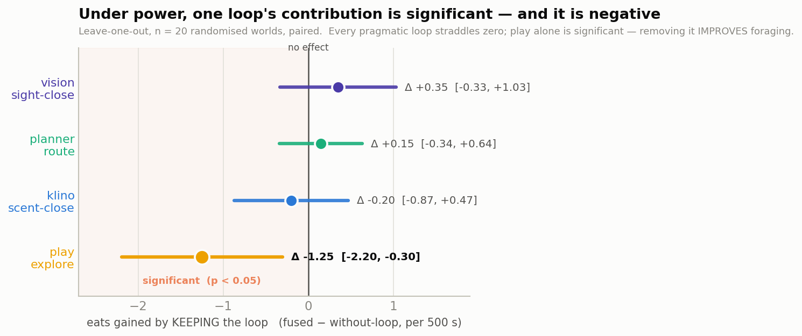
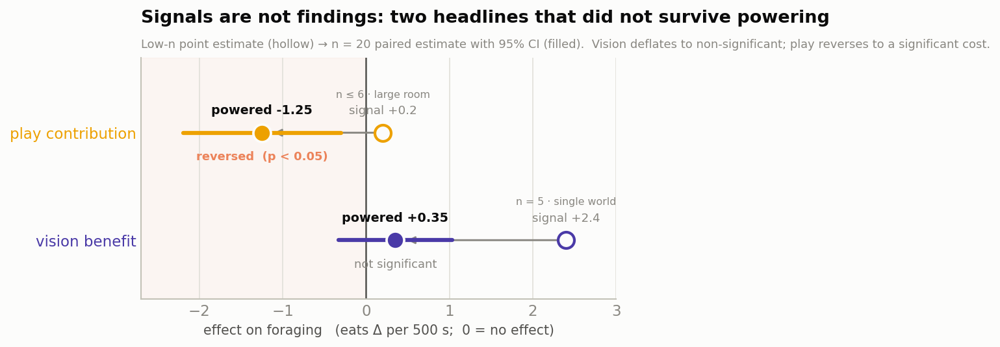
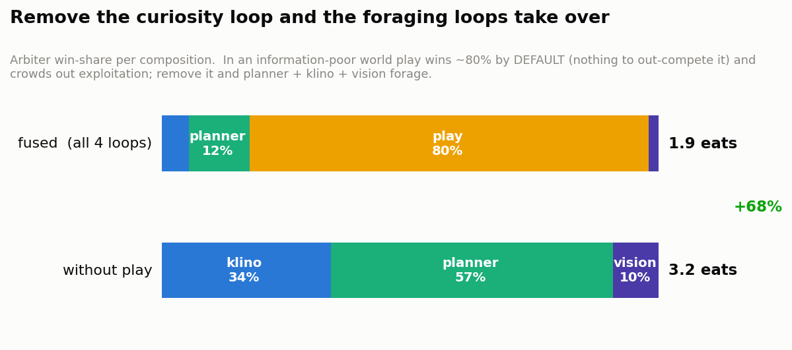
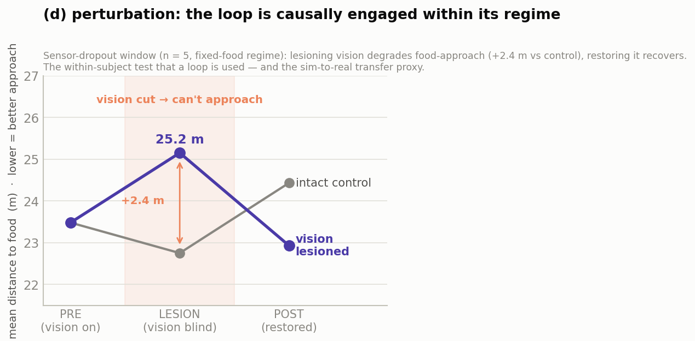
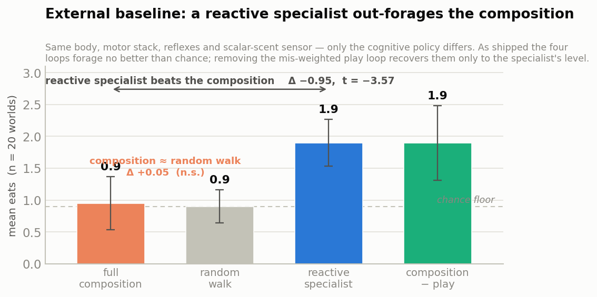

# The Cell Navigator — A Falsification Testbed for Markov-Blanket-Loop Active Inference

## Executive summary

**Can a machine's intelligence be assembled out of small, independent pieces — and how
would you know whether it worked?**

This report answers the second question more usefully than the first, and that is its
purpose.

The idea under test is appealing and old. Rather than building one large controller that
maps everything a machine senses onto everything it does, build several small ones. Give
each a single thing to work out about the world (which way the food smells, where the walls
are, what the camera can see) and let a referee decide, moment to moment, which one steers.
Each small piece is a **loop**, because it closes: it acts, watches what its own senses do
in response, and updates what it believes. The referee is the **arbiter**.

The reason to organize a machine this way comes from **active inference**, a theory in which
a creature does not chase rewards handed to it from outside but acts to make the world match
its own predictions. Hunger is a prediction of being fed, and the mismatch is what drives
the swimming. Nothing here is scored or given points.

The organizing concept is the **Markov blanket**: the boundary between a creature and its
world, crossed only by senses coming in and actions going out. Its consequence matters more
than its name. Anything on the far side of that boundary is unreachable. A swimmer cannot
read the direction of a chemical gradient the way you read a compass; it can only move,
notice whether the smell grew stronger, and infer. Every loop in this system is built around
one such unreachable thing.

We tested this on the **Cell**, a simulated single-celled swimmer that forages in a small
2-D arena using four loops and one arbiter. It is deliberately the cheapest embodiment we
could build: fast, reproducible, and disposable, so that claims break here rather than on a
robot.

**What we found.** The assembly does real work: switching loops off changes
behavior measurably, which a fixed priority ranking could not produce. But the curiosity loop
wins roughly 80 % of the decisions and is a net cost, because in a world with little to smell
or see it faces almost no competition. The agent explores itself toward starvation. As
shipped, the four-loop Cell forages no better than a random walk, and a single hand-written
chemotaxis controller — the strategy *E. coli* uses — beats it. Repair the arbitration defect
and the composition rises to tie that simple controller, not to beat it.

Two earlier headline claims from this project did not survive being measured properly. A
"+170 %" benefit from vision became +0.35 eats and statistically unresolvable once food was
placed randomly instead of in one favorable spot, and a claim that curiosity helps in large
rooms reversed into a significant cost. Both reversals came from the same correction: more
seeds, and worlds drawn at random rather than fixed.

The durable result is therefore not an architecture that works. It is a **discipline for
finding out** — paired comparisons, worlds sampled rather than fixed, confidence intervals
reported, an external baseline carried alongside, and a perturbation test that distinguishes
inference from a lucky reflex. The Cell is a methodology testbed, and its job is to break
claims cheaply before a 12-degree-of-freedom robot or a multi-room world makes breaking them
expensive. Section 9 says what comes next; section 10 states what we are not claiming.

---

## Introduction

### The system in brief

xaq is an embodied active-inference architecture: a "System 1" perceptual and motor
substrate rather than a language-model-style deliberator. It learns by minimizing prediction
error, is driven by internal homeostatic needs (food restores energy; collisions are aversive)
rather than an external reward signal, and touches the world only through its own sensors and
actuators.

The **Cell** is the smallest embodiment of that architecture and the subject of this report. It
is a single-celled swimmer that forages for food in a 2-D arena, sensing chemical gradients,
touch, sight, and its own internal energy. We use it deliberately: it is cheap to run, fully
reproducible, and lets us test the architecture's central design idea, and our own claims about
it, before committing to a legged robot or a multi-room environment.

That central idea is that a competent agent can be assembled from several small inference loops,
each responsible for one hidden feature of the world, coordinated by a single selector. The Cell
runs four such loops: scent-following, map-based routing, curiosity-driven exploration, and
visual homing (see §1). This report asks two questions. Does composing them produce competent
foraging, and how do we test that without misleading ourselves? The first answer turned out to
be "partly". The second is the document's main contribution.

### Markov blankets, briefly (for the newcomer)

The design rests on the idea of a **Markov blanket**. In a probabilistic model, the Markov
blanket of a variable is the minimal set of other variables that, once known, render it
conditionally independent of everything else (Pearl, 1988). Applied to an agent, the blanket is
the boundary between the agent and its world: *sensory* states carry information inward
(world → agent) and *active* states carry action outward (agent → world). Given this boundary,
the agent's internal states and the world's hidden states can influence each other only through
the sensors and actions between them (Friston, 2013; Kirchhoff et al., 2018).

The consequence for robotics is the crux of this report. A hidden property of the world, such as
the *direction* of a chemical gradient or the *location* of food, is never directly readable. It
sits on the far side of the blanket. The agent can only **infer** it by acting and observing how
its sensors change. Each of the Cell's loops is organized this way, as a small sub-agent that
infers one hidden variable through its own sense-and-act interface, and the whole agent is itself
a blanket around that assembly.

We treat Markov blankets here as an engineering organizing principle, a way to decompose a
controller into testable inference loops, not as a metaphysical claim about what makes something
an agent; that stronger reading is actively debated (Bruineberg et al., 2022). Readers new to the
framework will find Parr, Pezzulo & Friston (2022) the standard textbook, Friston (2010) a
readable overview of the free-energy principle, and Kirchhoff et al. (2018) the developed
Markov-blanket account of living systems. Full citations are in the References section.

### How it is built: the brain and the embodiment

The system has two halves that meet at the blanket.

**The brain** is a standalone C++ library. It holds the perceptual modules (Episodic Predictive
Modules, or EPMs), the cross-modal consensus layer, the four navigation loops, the reflexes, the
expected-free-energy arbiter that selects among loops, and the motor stage. It is configured
entirely from a text file listing which modules to instantiate and how to wire them, so a new
experiment is a configuration change rather than a code change.

**The embodiment** is a Godot 4 project. The brain compiles to a native shared library and loads
through the game engine's extension interface, which exposes it as a single node the engine can
create, seed, and step. A bridge script is the connection across the blanket: every physics tick
it reads the body's sensors, hands them to the brain, and applies the motor command the brain
returns. Library, node, and method names are in the appendix.

The Cell's body and world are modeled to give the blanket real content:

- **Actuation.** The brain emits a scalar steer and thrust; the body converts these into two
  flagella driven by Bernoulli spike rates, each spike adding a small impulse, integrated with
  first-order friction. The body is therefore a genuine physical integrator, and proprioception
  reflects real dynamics rather than smoothed controller output.
- **Sensors.** An eight-nostril chemical ring (sampling the scent field around the body), touch
  whiskers (contact with walls and pillars), a first-person camera (food-colored pixels feed the
  vision loop and a panoramic place-code), and interoception (an internal energy level that falls
  over time and defines hunger).
- **World.** A procedurally generated room (16 × 16 m) or maze, seeded per episode, with food
  sources that emit a chemical gradient. In the open room the scent falls off smoothly with
  distance, as e^(−d/σ), where the length scale σ (sigma) sets how far the smell carries. In the
  maze it is a screened-Poisson field relaxed over the free floor, so scent flows along corridors
  and around corners rather than through walls. Optional pillars add touch contacts and partially
  occlude scent. A world-randomizing mode redraws food positions and pillar layout for each seed,
  which is what makes the powered experiments below possible.

The same brain runs in two modes: interactively inside the Godot editor (with a live launcher,
on-screen instrumentation, and a separate desktop inspector that streams each module's internal
state over a socket), and headlessly through a scripted harness that runs many seeds without
rendering. All the quantitative results in this report come from the headless harness.

---

## 1. The object under test: nested Markov blankets

As sketched in the introduction, a **Markov blanket** is the sensory-and-active boundary of an
agent. Because the agent's internal beliefs and the world's hidden states interact only across
that boundary, a hidden external state (a gradient's *direction*, the food's *position*) cannot
be read directly. It must be inferred through action.

The method applies this recursively: each competent loop is a blanket around a sub-agent that
infers one hidden state, and the whole agent is a blanket around the assembly. The Cell forager
runs **four** such loops, each publishing a *(heading, confidence)* pair to one
**expected-free-energy (EFE) arbiter** that ranks them in shared units and hands one of them the
motor. The four short names below are used throughout the report:

| loop | infers (hidden state) | sensor (blanket channel) | acts to… |
|---|---|---|---|
| **klino** | scent-gradient *direction* | scalar scent | close on a *smelled* source |
| **planner** | food's place on the *map* | place-code (panorama) | route to a *remembered* region |
| **play** | where the map is *uncertain* | how unfamiliar the current place looks | grow the map (epistemic) |
| **vision** | food's *direction* by sight | food-pixel bearing | close on a *seen* source |

This is the object under test. The sections that follow do not assume it works; they measure it.

---

## 2. The powered result: the composition changes behavior, and reveals a mis-weighting

We removed each loop in turn, deadening its input to the arbiter so it can never win, with no
changes to the module itself, and measured the paired change in foraging across **n = 20
randomized worlds** (food positions and pillar layout drawn per seed, fixed within an episode,
shared across arms). A loop's contribution is the number of eats it earns: eats with the full
assembly minus eats with that loop deadened.

On a strict reading, only one interval clears zero, and it is negative:

- **klino** (−0.20, 95 % CI [−0.87, +0.47]), **planner** (+0.15, [−0.34, +0.64]) and **vision**
  (+0.35, [−0.33, +1.03]) each straddle zero. In this scent-poor, occluded regime none of the
  three pragmatic loops has a statistically resolvable individual contribution. The intervals
  also bound what could be hiding: at this sample size none of the three could conceal a true
  contribution larger than about one eat per episode, so these are bounded nulls rather than
  uninformative ones.
- **play is significant, and its contribution is negative** (−1.25, [−2.20, −0.30], paired-t =
  −2.76; the dense food-distance proxy agrees, +3.40 m, t = 2.96). Removing the curiosity loop
  *improves* foraging.

This is the report's main positive result: **the arbitration does real work, and the powered data
pinpoints a specific defect.** Removing loops measurably changes behavior. A fixed-priority
hierarchy (subsumption) could not produce this effect; it is the arbiter selecting the wrong loop
in this regime. §3 shows why the small-sample version of this same experiment misled us, §4
explains the mechanism, and §6 measures the whole composition against the obvious hand-coded
alternative.

---

## 3. Signals are not findings: two headlines that did not survive powering

The same measurements at **n ≤ 6 and a single fixed world** told a very different, much more
flattering story. Powering them across varied worlds reversed both:

- **Vision "+170 %" → +0.35 eats, non-significant.** The original A/B (n = 5, one far-corner food
  layout) showed base 1.4 → 3.8 eats. The favorable geometry, food on a clear cross-room
  sightline, was doing the work. Across 20 randomized layouts the paired benefit is +0.35
  ([−0.33, +1.03]): directionally positive but not resolvable. The leave-one-out's vision arm
  (§2) reproduces it exactly, and two independent measurements agreeing on "small and
  non-significant" is the reassuring part.
- **Play "asset in the large room (+0.2)" → −1.25, a significant cost.** The n ≤ 6 signal
  suggested play flipped from a cost (small fixed maze) to an asset (large room). Under power it
  is a cost in *both*, and significantly so in the large room.

Neither reversal is a failure of the method; each is the method working as intended. The
practices that produced them — paired designs, worlds sampled rather than fixed, confidence
intervals reported, effect sizes treated as provisional *signals* until powered — are the real
contribution of this line of work.

---

## 4. The mechanism: curiosity must yield to need

Why is an *explorer* a net cost? Because in an information-poor world it wins the arbiter by
default and never yields:

In the fused agent, play takes **~80 %** of the decisions, not because it is valuable, but
because the pragmatic loops are usually blind (scent is attenuated, food is rarely in view), so
there is almost nothing to out-compete it. It wanders, and it crowds out the planner. Deaden play
and the pragmatic loops finally take the motor (planner 57 %, klino 34 %, vision 10 %) and
forage, with eats rising 1.9 → 3.2 (+68 %).

Stated as an active-inference result: **an epistemically-driven agent will explore itself toward
starvation unless the arbiter down-weights curiosity under need.** A *fixed* epistemic weight
cannot do this; the balance between pragmatic and epistemic value must respond to the agent's own
homeostatic state. Play's role is discovery, and it earns its place where discovery is the
bottleneck. What the data identify is a mis-arbitration, and with it the next concrete piece of
work: need-gated epistemic weighting.

---

## 5. The (d) perturbation test: the loop is causally engaged within its regime

An on/off A/B (§3) can show that a loop *helps* on average; it cannot show that the help is
*inference* rather than a lucky reflex. The method's sharpest test is to perturb the world
mid-episode and watch the loop re-infer, a protocol this project labels the **(d) test**. We
lesioned the visual sensor for a window in the middle of an episode, so the agent goes blind and
then sees again, and measured **distance to food** (a dense proxy, since eats are too sparse to
fill a short phase), against a no-lesion control that subtracts drift:

The signature is clear: **perturbation → degradation → recovery.** Blind, the agent can no longer
approach food (+2.4 m versus the seeing control in the same phase); restore the sensor and
approach recovers. This is what separates *inference* from feedback control, and it is the
conservative transfer argument. We do not assert that the loop will survive a real-world sensor
gap. We demonstrate recovery from a sensor dropout, which is the same capability sim-to-real
requires.

The scope is narrow, though. This test ran in the **fixed-food regime**, where the loop
contributes, and it establishes that vision is *used when it can see*. It does not establish that
vision delivers a large net foraging benefit; §3 shows that benefit is small and non-significant
across worlds. Both statements are true and consistent: a loop can be genuine inference and, at
the same time, a minor contributor to the goal.

---

## 6. The external baseline: the composition does not beat a reactive specialist

§2 asked what each loop contributes to the *composition*; it could not say whether the
composition is any good compared to the obvious alternative. Here is that comparison, the
external baseline this report had been missing. We pitted the full four-loop agent against two
controllers that share its exact body, sensor (the *scalar* scent; the directional eight-nostril
ring is never published, so gradient direction stays a hidden state for every agent), motor
stack, and reflexes, differing only in the cognitive policy, across the same n = 20 randomised
worlds:

- **specialist** — a single reactive run-and-tumble chemotaxis controller (the *E. coli*
  strategy: raise the tumble rate when the scalar scent stops climbing). No map, memory, arbiter,
  exploration, or vision.
- **random walk** — the same loop made gradient-blind, tumbling at a fixed rate: the chance floor.

Mean eats (n = 20): random walk 0.9, full composition 0.9, specialist 1.9,
composition-minus-play 1.9. Read as paired differences over the shared worlds:

- **The reactive specialist significantly out-forages the full composition.** eats(composition)
  − eats(specialist) = −0.95 (95 % CI [−1.51, −0.39], paired-t = −3.57; worse on 12 of 20
  worlds). The dense food-distance proxy agrees: the composition ends +3.7 m farther from food
  (t = +5.06).
- **The shipped composition is statistically indistinguishable from a random walk.**
  eats(composition) − eats(random walk) = +0.05 (95 % CI [−0.39, +0.49], paired-t = +0.24). The
  interval is tight enough to be informative: it rules out any true advantage larger than half an
  eat per episode. As shipped, the four loops forage no better than chance.
- **The cause is the arbitration defect of §4, confirmed here as a positive control.** Deadening
  the play loop recovers foraging to 1.9 — eats(composition) − eats(minus-play) = −0.95 (95 % CI
  [−1.69, −0.21], paired-t = −2.70), reproducing §4's direction and landing exactly on the
  specialist.

The sharpest reading is the last number. Even with the defect removed, the composition only
*ties* the specialist (1.9 vs 1.9): the planner and vision loops add no measurable foraging
advantage over the single reactive loop in this regime. That is a property of the *regime*, not a
refutation of the architecture. In a world with one monotonic scalar gradient to a near-static
source a reactive specialist is near-optimal, and a world model is at best overhead. A model
earns its cost only where reactive policies provably fail: occlusion demands memory, confounds
demand fusion, non-stationarity demands continual learning. This testbed does not reward the
composition's capabilities, so the next regime must be chosen to *demand* one of them, with this
same specialist baseline carried along (§9).

The deflation of §3 applies to this comparison too. A two-seed pilot showed the debugged
composition *beating* the specialist (2.0 vs 1.5); at n = 20 they tie.

---

## 7. A new failure mode: a belief must be *learnable*, not merely disconfirmable

Vision contributes exactly zero in the ablation environment. That reads as a clean null, and it
is not one. The configuration uses a bearing detector that **learns** food's appearance from real
eats, which is the EPM-native design and the one the architecture prefers, since it requires no
hand-specified target. Under randomised, zone-colored food it never bootstraps a stable
appearance, so the detector stayed blind: vision-value was 0 on every tick. A hard-wired detector
in the same worlds fires normally (vision-value 1.0, winning 2.8 % of decisions). The original
"+170 %" had worked precisely because *fixed* food gave the learner a stable target.

The doctrine already required a belief to be **disconfirmable**. This adds a prior condition: a
*learned* belief must also be **learnable**, meaning it needs a stable, repeated teaching signal
to bootstrap at all. Randomising the target's appearance starves the learner. This is a direct
warning for perception transfer, because the real world has more appearance variability than our
world-randomizing mode, and a detector that cannot lock onto food color across simulated zones
will not survive a real camera. The architecture's advantage is that this failure is separable
and testable, the detector being one swappable module behind a fixed blanket interface, rather
than that the failure disappears.

---

## 8. Why the doctrine is shaped the way it is

Each principle in the companion doctrine traces to a specific failure or confirmation:

- **Check the *sensor* before the *policy*.** The move that started this line: improving the
  explore loop's coverage 2.5× moved eats *zero*. The bottleneck was a missing *channel*, not a
  weak *policy*. A stuck agent may be blind, not incapable. The channel we then added turned out
  to be a minor contributor (§3), but the *diagnosis* was correct, and it is the transferable
  skill.
- **Value in the modality's own units.** Vision's value had to be a *direction* confidence, not a
  *reach* proxy. The reach form made it confident only when already close, that is, redundant
  with scent, muting it in its own long-range regime.
- **A belief must be disconfirmable, and (§7) learnable.** Visual target-persistence was
  net-negative, an over-committed prior that suppressed the foraging that would correct it; the
  learned appearance detector fails to bootstrap without a stable target.
- **Value = contribution, not authority share.** Play wins ~80 % of the decisions and is a net
  *cost* (§2, §4). Win-fraction and value are independent, which is the single most important
  lesson here.
- **Isolate the regime.** Every loop's individual contribution is regime-dependent; a scent-poor
  occluded world under-tests klino and planner and over-exposes play's failure mode.
- **Scale the claim to the power.** §3 is this principle applied to our own results.

---

## 9. Development phases, and what we defer

We hold this work to a staged ladder; each rung is the next falsifiable milestone, and we state
why the later ones are deferred rather than claimed:

1. **Phase 1 — falsification testbed (this report).** Establish the discipline; show that the
   loop composition changes behavior and localize its defect; separate signals from findings on a
   cheap agent. *Delivered.*
2. **Phase 2 — external baselines.** *Partially delivered (§6).* The composition is now measured
   against a hand-coded run-and-tumble chemotaxis specialist and a random-walk floor in the same
   worlds, and it does not beat the specialist (it ties at best; as shipped it forages at the
   chance floor). Still deferred: a learned (reinforcement-learning) policy, and a re-test once
   the arbiter's known mis-weighting (§4) is fixed, so the comparison measures the design rather
   than the bug.
3. **Phase 3 — sim-to-real crossing.** Run the (d) perturbation test on a *physical* sensor swap
   (Raspberry Pi 5). *Deferred because:* the transfer proxy (the simulated (d) test, §5) had to be
   validated first, and the perception layer's fragility (§7) must be hardened before a real
   camera, which carries strictly more appearance variability.
4. **Phase 4 — continual learning without forgetting.** Fractal-JEPA and mitosis for online
   loop-spawning. *Deferred because:* it is unbuilt, and claiming it now would contradict the
   discipline this report argues for.
5. **Phase 5 — cross-body / cross-task transfer.** The doctrine predicts *in advance* what
   transfers to a new body or task. *Deferred* until Phases 2–4 give it something to predict.

The transferable asset across all phases is the **method**, not the numbers: the
signal-versus-policy-limited diagnosis, dense proxies for sparse goals, regime isolation, control
arms that subtract drift, the perturbation test as the test of inference, and powering before
promotion. The Cell's numbers do not transfer to a walking robot's balance loops or a
manipulator's grasp loops; its methods do.

---

## 10. Claims we are **not** making

Stated explicitly, because the method requires it and because these are the real limits:

- We do not claim the architecture is a working brain. It is a testbed.
- We do not claim the arbiter arbitrates *well*. It over-weights the epistemic loop in
  information-poor worlds (§4); correcting that is Phase-2 work.
- We do not claim any headline *magnitude* survived. The +170 % vision benefit is +0.35 eats,
  not significant; the "play helps in large rooms" claim is a significant cost.
- We do not claim sim-to-real. We demonstrate perturbation-recovery (§5) as a proxy for it.
- We do not claim the EPM is the right perceptual substrate. It is one choice, and its
  learned-appearance variant is fragile (§7).
- We do not claim fractal-JEPA or mitosis works. It is unbuilt (Phase 4).
- We do not claim the composition is competitive. We now have an external baseline (§6), a
  reactive chemotaxis specialist and a random-walk floor, and the composition does not beat the
  specialist in this regime (it ties at best; as shipped it forages at the chance floor). That is
  reported as a result, not buried.

---

## Appendix — methods and reproduction

For a reader who wants to re-run these experiments. Names below are the identifiers as they
appear in the repository.

**Code layout.** The brain library is `cpp_core`; the embodiment is the Godot 4 project in
`godot_host`. The brain compiles to `ami_ogma_host.so` and loads through Godot's GDExtension
interface as an `OgmaBrain` node exposing `setup(config)`, `set_master_seed(seed)` and
`tick(delta)`. The bridge is a `body_controller` script on a Godot `CharacterBody3D`. The live
desktop instrument is the PyQt v4 inspector.

**Loop implementations.** klino is `RunTumbleNavV2`; planner is `PlaceGraphNav`; play is
`PlayLoop`; vision is `VisualHomingNav`. Play's novelty signal is the place-EPM Time-Loop Error
(TLE). The learned-appearance detector of §7 is the VisualBearing detector with
`learn_appearance = true`.

**Harness and data.** Powered leave-one-out and the vision A/B come from
`scripts/cell_coverage.py` with `--vary-world` at n = 20; the perturbation test comes from
`scripts/cell_perturbation_d.py`. Raw paired per-seed deltas for §6 are in
`figures/baseline_powered_n20_raw.txt`. Confidence intervals are Student-t at 95 % with 19
degrees of freedom, computed from the raw paired deltas.

**Figures.** Generated by `scripts/make_report_figures.py`, using a validated colour-vision-
deficiency-safe palette, identity colours, and direct labels.

**Branch and date.** Branch `cell-maze`, 2026-07. The companion method document is
`docs/brain_building_doctrine.md`.

---

## References

- Bruineberg, J., Dołęga, K., Dewhurst, J., & Baltieri, M. (2022). The Emperor's New Markov
  Blankets. *Behavioral and Brain Sciences*, 45, e183.
- Friston, K. (2010). The free-energy principle: a unified brain theory? *Nature Reviews
  Neuroscience*, 11(2), 127–138.
- Friston, K. (2013). Life as we know it. *Journal of the Royal Society Interface*, 10(86),
  20130475.
- Kirchhoff, M., Parr, T., Palacios, E., Friston, K., & Kiebel, S. (2018). The Markov blankets of
  life: autonomy, active inference and the free energy principle. *Journal of the Royal Society
  Interface*, 15(138), 20170792.
- Pearl, J. (1988). *Probabilistic Reasoning in Intelligent Systems: Networks of Plausible
  Inference.* Morgan Kaufmann.
- Parr, T., Pezzulo, G., & Friston, K. (2022). *Active Inference: The Free Energy Principle in
  Mind, Brain, and Behavior.* MIT Press.

---

*Living document: the phases above are the roadmap, not a promise.*
