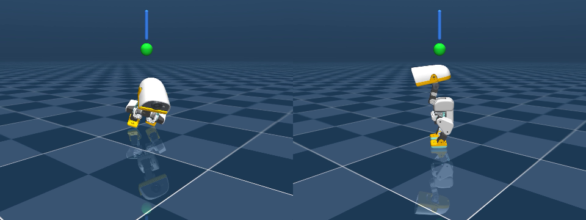

# The Duck Stands — how a small robot found its own balance, and what it took

## Executive summary

**Can a robot learn to stand up, and to catch itself when pushed, without anyone telling
it what standing is?**

The robot is Pollen Robotics' Open Duck Mini, a 1.5 kg bipedal walker with a head that
weighs more than a third of it, simulated in MuJoCo. It has no passive standing pose: hold
its servos still and it topples within a second, like a broom balanced on a fingertip.
Pollen ships a trained neural-network policy that stands and walks it. We did not use that
policy to teach anything. It acts only as a **scaffold**: when the robot falls, it picks the
body up, hands it back, and steps aside.

What learns is a brain built on **active inference**: rather than being rewarded for
standing, it holds a prediction that its own body is upright and level, and acts to make
that prediction come true. It knows nothing about the body in advance. It finds out what
each joint does by **babbling**: pushing one joint at a time, in short held pulses, and
watching what its senses report. From that it builds a small model of cause and effect,
and from the model it learns a controller.

**What we found.** For most of the campaign the brain could stand on one of six random
starts, taking half an hour to get there, and it could not catch a push: a 2 N shove for a
tenth of a second put it on the floor every time. The reason turned out to be in the
babbling, not the brain. The pulses on the right leg and on the head were being read while
the body was still moving from the previous pulse on the left leg, so the brain's model had
the wrong sign for how those joints tip the body. It had learned to catch a lean with one
leg. Fixing the schedule so that every pulse starts from a still body changed everything at
once:

- **six of six starts stand**, consolidating inside 15 minutes instead of one in six at
  30 minutes, with two or three falls in the following two hours;
- the stance is quieter and lower-effort than before (0.35° of tilt, motor effort halved),
  and it holds under the servo lag the real robot's firmware applies;
- **it catches**: 2 N shoves are caught 35 times out of 36 across the six brains, peaking
  at under 3° and settling within 0.6 s, where before one in six survived; 3 N is the edge.

The catch is a whole-body one, head, hips and ankles together, and it is a reflex the brain
found rather than one we wrote. Its limit is the angle the feet can hold. Past that the
only recovery is a step, and this brain does not yet know how to take one. That is the
next question, and it is a different kind of question, discussed at the end.

Three things that did not work are reported as results, because each narrowed the search:
leaning the body during learning to provoke a reflex, weighting the brain's attention toward
its attitude, and lengthening the babble pulses. None produced a catch, and the last two
cost the robot its ability to stand at all.

## Introduction

### The system in brief

A simulated Open Duck Mini stands on a flat floor in MuJoCo, Pollen's own model files
loaded unmodified. A host program runs the physics at 50 brain ticks per second, feeds the
brain what the robot's sensors would report, and applies the brain's joint commands as
servo targets. The same host runs the **recovery harness**: a fall detector that reads
projected gravity (the same signal the real robot's IMU provides) and, when the body has
gone past about 60° for a fifth of a second, hands the joints to Pollen's standing policy
until the body is upright and still, then hands them back. Every hand-off is logged. The
brain's learning is frozen while the scaffold drives, so nothing it learns comes from the
scaffold's motions.

The brain sees only what the body senses: joint positions and the servo's own report of
the commanded position, the direction of gravity in the body frame, the three rotation
rates, linear acceleration, and the head's own gravity direction and mass position. It has
no access to where the body is in the world or how far it has tilted in an absolute
sense. This is the **Markov blanket** discipline of the doctrine that governs the project
([`docs/brain_building_doctrine.md`](../brain_building_doctrine.md)): a controller may use
only what would be available on the hardware, so that anything it learns can leave the
simulation.

### Standing as a prediction

In active inference a creature does not collect points. It carries predictions about
itself and its world and acts to reduce the mismatch between prediction and sensation.
Here the brain holds a **state prior**: a set of sensory values it expects to be true. For
this brain the prior says the gravity vector points straight down through the body (no
lean), the rotation rates are zero (no motion), and the joints sit at a calibrated standing
pose. Everything the brain does is descent on the mismatch between that prior and what it
senses.

Two modules hold this brain, one for the ten leg joints and one for the four head and neck
joints. Each contains a **self-model**, a small linear map from "what I commanded" to "what
my senses did next", and a **controller**, a map from what the senses report to what to
command next. The self-model is identified by babbling. The controller is learned by
descent on the prior's mismatch, routed through the self-model: the brain works out *how*
to reduce a lean from its own estimate of which joints tip the body which way.

Two more mechanisms matter for reading the results. **Consolidation** is earned permanence:
while the prior is satisfied and the body has not fallen for ten seconds, learning rates
anneal toward zero, so a stance that works stops being rewritten by the learning that found
it; a fall re-arms learning. And **identification episodes** structure the babbling: the
host lets the brain pulse for a few ticks, then has the scaffold settle the body, then lets
it pulse again, so that each pulse is applied to a still body rather than a toppling one.

### Vocabulary used below

- **Pulse window**: the ticks during which one joint is held at a small offset and the
  sensory response is measured. A pulse and its mirror-image partner form a pair; the
  difference between their responses, divided by the offset, is one column of the
  self-model.
- **Settle**: a scaffold-driven pause that returns the body to stillness between pulses.
- **Envelope**: the largest push a stance survives without a rescue, measured with a 0.1 s
  shove on the trunk from four rotating directions, six shoves per force.
- **Rescue**: a hand-off to the scaffold after a fall. Rescues per minute is the running
  measure of a stance's stability; a consolidated stance has near zero.

## 1. The object under test: the identification schedule

Everything that changed between the stance that could not catch and the stance that can
is one scheduling rule. In the earlier configuration the host settled the body after every
twelve brain ticks, which is two pulse windows of six ticks each. The babbling alternates
legs from one window to the next, so the left leg's window began on a settled body and the
right leg's began on a body still moving from the left leg's pulse. The head module used
seven-tick windows, so its windows drifted across the settle boundary and roughly half of
them were cut by a settle and discarded.

The change under test: settle after **every** window, and give the head the same six-tick
window as the legs. Every pulse, on every joint, then starts from a still body. Nothing in
the brain's code changed; the host's settle period and one module parameter did.

The prediction was specific: the self-model's estimate of how the right leg and the head
tip the body should come to agree with the true mechanics, the brain should then build a
two-legged rather than a one-legged reflex, and the stance should become both easier to
find and able to catch a push.

## 2. Results

### 2.1 Standing on every start

Six brains were trained from scratch for two simulated hours, each with a different random
seed (the seed varies the exploration noise; the babbling itself is deterministic). The
comparison is the previous best configuration, which differed only in the settle schedule.

| | previous schedule | settle before every pulse |
|---|---|---|
| starts that consolidated within 2 h | 1 of 6, at 30 minutes | **6 of 6, inside 15 minutes** |
| rescues in 2 h | 128 on the one that stood; 1300 to 2300 on the others | 2, 3, 2, 2, 2, 2 |
| tilt while standing | 1.0° | 0.35° |
| distance from the calibrated pose | 0.069 rad mean | 0.036 rad |
| mean motor effort (fraction of full) | 0.34 to 0.8 | 0.18 |
| joint motion at rest | 11 to 13 mrad per tick until separately quieted | below the 0.05 mrad measurement floor |
| self-model prediction error while upright | 0.85 | 0.06 |

The identification phase itself ends sooner (170 s instead of 202 s) and with no falls at
all, where the old schedule produced 107 falls in the twenty minutes after identification.

A note on what "six of six" is worth. The doctrine distinguishes a **signal** (a handful of
fixed seeds, enough to promote or kill a direction) from a **finding** (twenty or more varied
seeds and a perturbation test). Six seeds with an outcome this uniform is a strong signal;
we call it a finding only after the wider battery in the next-steps list.

### 2.2 The catch

Each of the six brains was shoved from four rotating directions, six shoves per force, and
a shove counts as caught if the brain kept the body upright without a rescue.

| shove, 0.1 s | previous stance (one brain) | this stance (six brains) | Pollen's standing policy |
|---|---|---|---|
| 1 N | 5 of 6 | 36 of 36 | not tested |
| 1.5 N | 3 of 6 | 36 of 36 | not tested |
| 2 N | 1 of 6 | **35 of 36** | 6 of 6, peaks 0.4° to 7.9° |
| 3 N | 0 of 6 | 13 of 36 | 6 of 6, peaks 0.5° to 4.8° |
| 5 N | 0 of 6 | not tested | 6 of 6, peaks 3° to 11° |
| 7 N | — | — | 3 of 6 |

A 2 N shove now peaks at 2.3° to 3.0° of tilt and the body is back under 1° within 0.6 s,
on every heading. The previous stance leaned 3.7° at 1 N and stayed there, and at 2 N
took 0.8 s to reach the floor with no visible change in the motor commands during the
first 0.4 s: it was statically stable and nothing more. The catch is visible joint by
joint: in the first 400 ms the neck pitches 20 to 40 mrad, both hips move about 30 mrad and
both ankles about 15, in a coordinated pattern. At 3 N the pushes from the side are
caught and the pushes from front and back go over; the edge is the sagittal one.

The reference for scale is Pollen's trained policy, which catches 3 N and 5 N and is
knocked over by 10 N. The brain's envelope is now about half of it, up from about a
quarter.

### 2.3 Sustained pushes, and the real robot's servo lag

The operator's live test was a gentler, longer push: 0.8 N held for two seconds, every six
seconds. The brain leans against it and holds, 46 of 48 times, at 1.6° to 2.8° of tilt.
Held at 1.5 N it survives 5 of 44, and at 2.5 N none. So the limit is not the impulse: a
0.8 N push held for two seconds delivers five times the impulse of a 3 N shove and is
caught, while the shove is not. What bounds the catch is the angle the feet can hold the
body at. Beyond that angle the body must step, and it cannot.

The real robot's firmware applies a low-pass filter to servo commands. Run with that filter
in the loop, the stance is unchanged: no falls in ten minutes, joint motion 0.02 mrad per
tick, and the same envelope (6 of 6 at 1 N and 2 N, 1 of 6 at 3 N). The earlier stance
could not run through that lag at all. This is the first result in the campaign that speaks
directly to leaving the simulation.

### 2.4 After a fall

When a 3 N shove does put the body down, the scaffold rescues it, the brain's consolidation
drops from 1.0 to 0.9, learning re-arms in proportion, and the stance is re-earned nineteen
seconds later; the stillness returns with it. The perturbation loop, push, wake, recover,
re-consolidate, was measured in full on the previous stance (twenty of twenty clean cycles,
re-earned in 38 s each) and holds here with a smaller cost per fall.

## 3. Why the schedule mattered

The host has an independent probe that measures the body's true mechanics: it holds each
joint in turn and records how the gravity vector moves, giving the actual authority of every
joint over pitch and roll. Comparing the brain's self-model against that probe, per module,
locates the defect exactly. The table shows the cosine between the learned and the true
authority vectors (1 is perfect agreement, 0 unrelated, negative reversed):

| self-model row | left leg, pitch / roll | right leg, pitch / roll | head, pitch / roll |
|---|---|---|---|
| previous schedule | 0.86 / 1.00 | **−0.22** / 0.98 | **−0.23** / 0.02 |
| settle before every pulse | 0.84 / 0.99 | **0.54** / 0.93 | **0.51** / 0.42 |

Roll was learned correctly on both legs under either schedule, because a sideways
response is fast and large. Pitch, the forward-and-back lean that topples this body first,
was learned correctly on the left leg only. The right leg's pitch row, read from a body
already rocking from the left leg's pulse, came out reversed; so did the head's, whose neck
joint has the largest pitch authority of any joint on the robot.

The consequence follows directly from how the controller is learned. The descent that
turns the prior's "I should not be leaning" into joint commands routes through the
self-model's estimate of who can fix a lean. With one leg's estimate right and the other's
reversed, the brain built a restoring reflex in the left leg and nothing useful in the
right. A lean answered by one leg twists the body rather than catching it, which is what
the earlier topples looked like in the joint traces (left ankle moving 128 mrad, right
ankle 20). The controller's attitude columns were restoring in every standing brain we
examined, before and after the fix; they were simply one-sided.

Two other observations sharpen this. Pollen's policy, the probe's hand-tuned reflex on the
true mechanics, and this brain all catch within the same physical limit, the support
polygon of the feet; no linear reflex reaches past it. And the previous stance's
one-sidedness was invisible to every aggregate we watched (tilt, falls, consolidation) and
visible only in a per-joint reading against the probe. The instrument that found the defect
was a comparison, not a metric.

## 4. What did not produce a catch, and what each taught

These are results, each measured against a healthy baseline, and each redirected the work.

**A world with wind.** Small shoves throughout learning (0.3, 0.5 and 0.7 N every eight
seconds, two hours, on the seed that stood) did not prevent standing and did not produce a
catch: the envelope was unchanged, and a brain kept awake by the shoves eroded through the
second hour. The controller's restoring attitude gain grew three to seven times under the
wind. Gain was not what was missing. (n = 1 seed × 3 forces; a signal.)

**Attitude precision.** Weighting the prior's attitude terms three and ten times above its
posture terms lost the standing race on every seed (0 of 6 at either weight), and applied
to an already-standing brain it destroyed the stance within ten minutes. More attitude gain
into a loop that already sat at a limit cycle produced faster oscillation, not a catch.

**Longer babble pulses.** Holding each pulse for 25 ticks instead of 6 was meant to let a
joint torque become a visible lean inside the measurement window. It could not: with this
body's lack of a passive equilibrium, an idle one-second pair topples on its own, at any
pulse amplitude, so the long window measured the fall rather than the joint. A 12-tick pulse
stayed inside the topple time, identified cleanly, predicted better, and still lost the race
on all six seeds. The usable window is set by the body, and inside that window the defect
was the schedule, not the horizon.

**The consolidation tax.** A separate finding along the way: a change made earlier to make
a resumed, consolidated stance wake properly after a fall (a fixed decay of consolidation on
every rescue) had made standing from scratch impossible in the previous configuration. At
the fall rates a learning brain passes through, one fall per twenty seconds, the decay and
the re-earning balance at a consolidation of about 0.4, which is exactly the plateau
observed. Reducing the per-fall decay restored the previous stance; it is also the setting
the new schedule runs under.

## 5. Limits, and the next step

**What this stance is.** A learned, whole-body, in-place balance reflex on a body with no
passive equilibrium, found from scratch in fifteen minutes on every start we tried, robust
to the real servo lag, with about half the push envelope of a trained locomotion policy.

**What it is not.** It does not step. Its catch ends at the angle the feet can hold, and
every push past that ends on the floor. It has been shown on one body, one simulator and
six seeds, with the perturbation test run in full on its predecessor and once on it.

**The next step is a step.** The operator's summary from watching it is the right one:
balancing has been maximized up to the point where the robot needs to move a foot. In
this project's terms a step is not a behaviour to write but an error to minimize, and the
first question is what the brain would need to sense to have that error at all. Today it
senses its lean and its joints, but nothing about where its feet are relative to its
weight. A step is the discovery that moving a foot changes what the feet can hold: a
prediction about contact and support that this brain currently has no channel for. That
makes it, by the doctrine's own rule, a sensing question before it is a control question,
and a design discussion before it is a lever. Two routes are open, and they put the
boundary of the learning in different places:

1. inside the framework, give the brain a sense of foot load and contact and let the
   support constraint enter the prior, so that a step can emerge from the same descent
   that produced the catch;
2. at the intent boundary, let this brain sit above Pollen's walking policy and ask it to
   step, keeping their stack whole and adding the reflexive layer on top.

Nearer work, in order: run the perturbation test in full on this stance with the complete
metric set; widen the battery to twenty seeds and varied world seeds so that "six of six"
becomes a finding; check whether the head's pitch authority, the weakest row the schedule
fixed (cosine 0.51), sets the front-to-back edge at 3 N and whether more head pairs move
it; and take the servo-lag result toward the hardware, where the state-velocity and
current fields the brain would want on the real robot are prepared but not yet submitted
upstream.

## 6. Claims we are not making

- We do not claim the robot walks, or can recover from anything beyond the support
  polygon of its feet.
- We do not claim a general balance controller. The catch was measured on one body in one
  simulator, at room-temperature physics, on a flat floor.
- We do not claim to beat Pollen's policy. Its envelope is about twice this stance's, and
  it also walks. The relation is the one the project intends: the brain is a learned layer
  that could sit above their stack, not a replacement for it.
- We do not claim that six seeds make a finding. They make a strong signal; the
  twenty-seed battery is listed as next work.
- We do not claim the identified self-model is accurate. The head's pitch row agrees with
  the true mechanics at cosine 0.51, the right leg's at 0.54. They are right in sign and
  rough proportion, which was enough; they are not measurements.
- We do not claim anything about hardware. The servo-lag result is the first evidence
  that points that way, and it is evidence from a simulation.

## Appendix: methods and reproduction

Everything runs from the repository root; the host is `mj_host/build/ogma_mjhost` and the
experiment launcher (`./mj_host/run.sh launcher`) has presets for each command below. All
runs are deterministic for a given seed and command line; a live window of a command shows
the same run the numbers came from.

- **The stance, from scratch (2 h, saves the brain):**
  `ogma_mjhost --brain --graph mj_host/configs/a1v2_r19_settle_each.json --secs 7200 --seed S --ident-every 6 --ident-until 3000 --save-brain out.json`, seeds 1 to 6. The previous schedule is `a1v2_r13_tax001.json` with `--ident-every 12`.
- **The checkpoint:** `mj_host/checkpoints/duck_r19_s2.json` (seed 2 at two hours). Resume with the same config, no identification flags.
- **The envelope:** resume the checkpoint with `--secs 420 --push N --push-hold 0.1 --push-every 60 --push-from 30` for N in 1, 1.5, 2, 3; `mj_host/tools/push_report.py` reads the per-shove table (peak tilt, recovery time, whether the scaffold intervened, consolidation before and after).
- **Sustained pushes:** `--push 0.8 --push-hold 2 --push-every 6 --push-from 8`, 300 s.
- **The servo lag:** add `--servo-filter`.
- **The scaffold reference:** `ogma_mjhost --hold --secs 420 --push N --push-every 60 --push-from 30`.
- **The true mechanics:** `ogma_mjhost --probe --secs 60` prints the per-joint pitch and roll authority; the self-model rows are read from a saved brain (column-major matrices, `rows_A` × `cols_A`).
- **The measures:** rescues are hand-off events in the run log; tilt is the angle between body-up and world-up, world-frame and for the reader only; joint motion is the mean per-tick change across the fourteen joints; pose distance is the mean absolute difference from the standing keyframe; effort is the mean absolute command as a fraction of full scale.
- **The record:** the campaign's internal design document, [`docs/plans-and-designs/microduck_rung2_regime_design.md`](../plans-and-designs/microduck_rung2_regime_design.md), sections 11 to 14, carries every arm, number and verdict, including the process notes that do not belong here.
