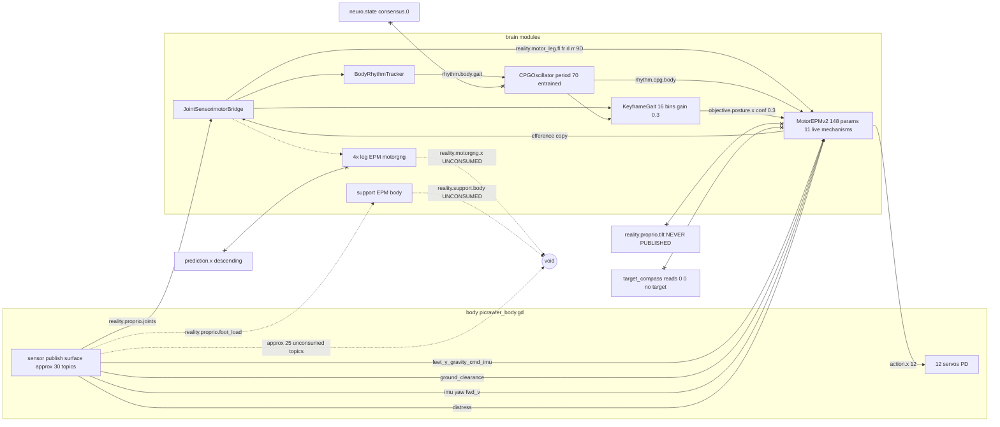
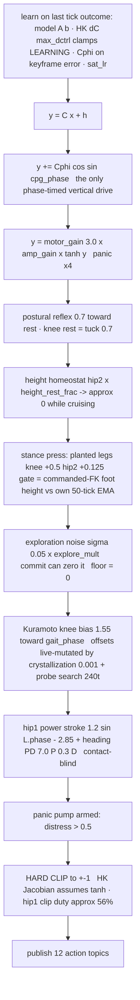

# Motor-system audit — 2026-08-09

> ## ⚠ SAME-DAY CORRECTION (evening)
>
> **§4's behavioral thesis is retracted; the structural findings (§1–§3) all stand.**
> The "level-ground shuffle attractor" and the walk-fraction numbers were manufactured
> by a latent process crash: a hardened-libstdc++ assert (armed by the day's first
> rebuild since the toolchain upgrade) killed every run at the moment progress-commit
> saturated — i.e. when the body committed to walking — and the harness scored the
> corpses. With the crash fixed, the canonical config walks 6/6 screened seeds at
> net_z ~6.5 (~110 real steps): **the Aug-7 baselines reproduce, and the "baseline
> non-reproduction" mystery is closed** (never FP basins — a hardening flag). What §4
> got right survives re-reading: stepping is still arrhythmic (`step_cv` ≈ 1.0,
> `td_plv` ≤ 0.21 *on walking runs*), the press-fights-lift window is real trace
> physics, and the operator's continuous-gait goal remains open — as a RHYTHM problem,
> not a walk/shuffle problem. Full record: lever ledger §4 ★★★★ entry (2026-08-09).

**Scope:** the deployed stack config
`the_picrawler_motor_epm_embed_corridor_imufused__stroke12__gng__bellyset__stancehip2__supportepm.json`
and every module it instantiates (JointSensorimotorBridge, MotorEPMv2, CPGOscillator,
KeyframeGait, BodyRhythmTracker, 4× leg EPM, 1× support EPM), plus the body's publish
surface (`picrawler_body.gd`).

**Method:** three independent code passes (topic pub/sub graph; the full 148-param
MotorEPMv2 mechanism inventory; the per-tick control-law and timing trace), cross-checked
against the lever ledger. Line references are to the tree at commit `d91f080`.

**Why now:** the operator observed unconsumed EPM outputs in the UI brain graph and asked
for a full audit before any higher-level active-inference loop is built. The audit
confirms the observation and finds it is one instance of a pattern.

---

## 1. Executive summary

1. **The config's true surface is far smaller than its file.** MotorEPMv2 exposes 148
   params; the deployed config sets 48; the live mechanism count is ~11. Three of the 48
   *configured* params are silently dead (`balance_gain`, `coord_stab_penalty`,
   `nav_gain` — §3.1), and two mechanisms are live through **header defaults that appear
   nowhere in the config** (the panic pathway; the lateral-v subscription).
2. **All five EPMs are pure observers.** The four leg GNGs and the support EPM publish
   RealityTokens that nothing consumes. Their predictive-coding input sockets
   (`prediction.*`) are also unfed, as are `neuro.state` and `consensus.0`. The EPM
   layer — the substrate the doctrine is built on — is currently disconnected from
   behavior in both directions.
3. **The timing substrate is broken in a specific, measured way.** The per-leg phase
   every rhythm consumer rides (`L.phase`) runs **backwards 2 ticks in 3**
   (`phase_retro` = 0.666 — the atan2 velocity arm is raw per-tick delta noise). Three
   clocks free-run against each other: the knee-derived stroke clock (~22–24 ticks), the
   true step period (~26–30), and the foot-height swing detector (~12–15), beating at
   ~2–2.5 s. Nothing anywhere in the timing chain references ground contact: the stroke's
   push direction is statistically independent of stance (0.512 vs 0.513).
4. **The 7–9-tick pressed-braking window is guaranteed by construction.** Liftoff is
   produced indirectly (learned Cphi cycle + *withdrawal* of the stance press), but the
   press is gated on a swing detector that only flips once the **commanded** foot height
   has risen above its own ~50-tick EMA — i.e. the press stays on until the lift is
   already well underway against it. The stroke reversal, by contrast, is command-instant.
   The two purpose-built countermeasures (`stroke_phase_src`, `stance_release_frac`) are
   both 0 in the deployed config.
5. **Three integrators ratchet with no leak**: `chassis_h_max_` (pure max, never decays,
   sets the height setpoint), `height_bias_` (cannot unwind while walking), per-leg
   `amp_gain` (rectifying, clamps 0.1–5). All the guards built for them
   (`homeo_leak_*`, `height_unwind_free`, `homeo_upright_gate`) are off.
6. **Exploration can reach exactly zero** (`explore_floor` = 0): full progress-commit
   zeroes the noise σ — the documented "frozen-but-confident" state.
7. **Oracle status is better than the sensor-legitimacy doc records** for this arm: the
   `feet_y` world-Y oracle is repaired (`feet_topic` = gyro-fused commanded-FK) and
   `nav_gain`'s oracle never actually engages in the corridor (no target published).
   Remaining soft-oracle dependencies: `progress_commit` and the height-fade read
   `imu[2] fwd_v` (world-velocity projection); `distress` (panic input) uses world-XZ
   displacement history.

---

## 2. System diagrams

### 2.1 Module / topic graph (deployed config)

Legend: solid = live control path · dashed = observer/instrument (no consumer) ·
crossed = configured but dead.



### 2.2 Per-leg command assembly (execution order, live terms only)



### 2.3 The three unsynchronized clocks

```mermaid
flowchart LR
  KNEE[knee pos and raw delta] -->|atan2 retro 2 of 3 ticks| LPHASE[L.phase 22-24t]
  LPHASE --> STROKE[hip1 stroke sin phase - 2.85]
  LPHASE --> KUR[Kuramoto knee bias]
  LPHASE --> AMP[amplitude homeostat]
  LPHASE --> FIT[coordination fitness]
  FOOT[commanded-FK foot height] -->|vs own 50t EMA no deadband| DET[swing detector 12-15t chatter approx 2x per step]
  DET --> PRESS[stance press gate]
  CONTACT[true step period 26-30t physics] -->|REFERENCED BY NOTHING| X((no consumer))
  STROKE -. beats approx 2.5 s .- CONTACT
  DET -. relaxation oscillator vs stride .- PRESS
```

---

## 3. Cruft inventory and dispositions

### 3.1 Configured-but-dead (the traps — fix or delete; these mislead every reader of the config)

| Item | Why dead | Disposition |
|---|---|---|
| `balance_gain = −0.5` + `tilt_topic` | body `publish_tilt` defaults false → tilt never arrives; term executes, adds 0. Listed in `scaffolds_active` as "balance" | Either publish tilt (making an untested reflex live — needs an A/B) or remove both from the config and from `scaffolds_active`. **Recommend: remove from config**; re-propose as a lever if wanted |
| `coord_stab_penalty = 0.3` | same unpublished tilt → wobble penalty ≡ 0; the mode-1 coordination fitness runs unpenalized | Remove from config, note in ledger that every mode-1 result to date ran without the stability penalty |
| `nav_gain = 5.0` + `nav_topic` | corridor `target_mode` is "off" → `target_compass` ≡ (0,0) → the nav gate never passes. The declared oracle has not actually steered the corridor runs | Keep the declaration honest: either drop to 0 in the corridor config or annotate that it is latent. ⚠ It **would** engage in the arena when pyramids are targeted — a hidden cross-gym behavioral difference |
| `heading_gain = 0.0`, `steer = 0.0` | explicit zeros | Harmless; leave |

### 3.2 Live-but-invisible (in code defaults, absent from the config)

| Item | Status | Disposition |
|---|---|---|
| Panic pathway (`distress_topic`, `panic_on` 0.5, `panic_off` 0.25, `panic_noise` 0.4, `panic_push_*`) | ARMED via header defaults; only `panic_motor_mult = 4.0` is visible in the config | Surface the whole family in the config explicitly (values unchanged) so the config states what runs |
| `lateral_topic` subscription | subscribed by default; both consumers off — instrument only | Leave; note it |
| `explore_floor = 0` | commit can zero exploration entirely | This is a **design decision hiding as a default** — the anti-freeze floor exists and is off. Candidate lever, not a silent default |

### 3.3 Unconsumed observers (the operator's UI observation, confirmed)

- `reality.motorgng.{fl,fr,rl,rr}` and `reality.support.body` — all five EPM token
  streams, no consumer. **Disposition: decide, don't drift.** Either they are the
  substrate of the next mechanism (a body-level predictor consuming/stacking them — the
  operator's own proposal) or they cost tick time and config surface for nothing. Keep
  only with a named plan; otherwise move to an instrumented variant config.
- ~25 body topics with zero subscribers (`compass`, `vel_ego`, `feet_y` legacy family,
  `foot_contact`, `joint_torque`, `joint_load`, `upright`, buckets, leg ids…).
  **Disposition: keep** — publishing is cheap and several are the legal egocentric
  signals future levers need (`foot_contact`, `joint_load`), but the audit table (§2 of
  reader A's report, archived below) is now the reference for what is actually read.
- Events: only `events.miss` and `events.reset` are acted on; the rest of the event
  vocabulary is received and ignored by MotorEPMv2.

### 3.4 Unfed sockets

`prediction.motorgng.*` / `prediction.support.body` (descending predictions — the EPMs
run on raw encodings; predictive coding is structurally present, unused),
`neuro.state`, `consensus.0`, `intent_topic`, `goal_bearing_topic`, `upright_topic`,
`contact_topic`, `torque_topic`, `rhythm_topic`, `velocity_objective_topics` (Cvel has
never trained). **Disposition: leave; these are the architecture's growth surface — but
any doc claiming the EPM layer "runs on" predictive coding overstates this config.**

### 3.5 Ratchets without leaks

| State | Shape | Risk |
|---|---|---|
| `chassis_h_max_` | pure max, never decays, persisted in snapshots; height setpoint = `height_k_eff ×` this | one anomalous clearance sample permanently raises the height target |
| `height_bias_` | integrator, clamp [−0.5, 1.5], no leak, output faded (not unwound) while walking | the documented post-inversion latch (walk degraded ~200 s) |
| `L.amp_gain` | rectifying integrator, clamp [0.1, 5], no leak | the inversion-windup shape; every guard for it exists and is off |

**Disposition:** these are known, documented, and guarded-off-by-choice; the audit's
contribution is putting all three in one place. Any long-run or hardware deployment must
revisit them.

### 3.6 Gain-0-guarded refuted/deferred levers (correct per convention — no action)

~60 params: DEP, sense/PM confinement terms, lookahead, whole-body C, symmetry pulls,
Cruse 1/2/3/5, tibia plumb, swing tuck, height_lift_knee (doubly dead by design — its
path is ×`height_rest_frac` → 0 while walking), stroke_load, step-clock family
(`stroke_phase_src` + 5 sub-params), support selector, commit precision, heading trim,
fades, boredom/cog cell family, etc. The full 148-row table is archived with this audit.

### 3.7 RNG accounting (determinism)

Noise draws are behavior-dependent (commit zeroing σ skips draws), `coord_rng_` is
drawn every tick and multiplied by zero (`coord_explore` = 0), and probe proposals draw
every 240 ticks. Consequence: **param changes can shift RNG stream alignment even when
the mechanism is inert** — a same-seed A/B can differ by stream divergence alone. The
basin lottery (ledger §4, 2026-08-09) makes this material: trajectory-level comparisons
should never be attributed to a mechanism without the gain-0 byte-identity check.

---

## 4. First-principles analysis — why there is no confident continuous gait on level ground

### 4.1 The capability signature, stated precisely

The body **can**: hold a heading (bearing-hold PD — promoted, variance-collapsing),
right itself and improvise escapes (panic + HK exploration), and traverse rough ground
(rumble raises step count ~2×; obstacle contact recruits adaptation).

The body **cannot**: sustain stepping on level ground (2–5/20 seeds walk; the rest
shuffle, terrain-independently), hold a step rhythm anywhere (`step_cv` ≈ 1.0 in every
arm ever measured — memoryless inter-step intervals), or predict contact
(`td_plv` 0.04–0.10; commanded stroke reverses 7–9 ticks before liftoff, body-wide).

### 4.2 The structural findings that explain it

**(i) There is no trustworthy rhythm substrate.** `L.phase` — which the stroke, the
coupling, the amplitude homeostat, and the coordination fitness all consume — is a raw
atan2 readout whose velocity arm is unfiltered per-tick delta; it runs retrograde 2/3 of
ticks. The one repair tried (velocity-arm filtering) was itself refuted (−57% net_disp),
and both repair knobs are off. Everything rhythmic is built on jitter.

**(ii) Nothing predicts or even references contact.** Three clocks free-run and beat.
The stroke's push direction is statistically independent of stance. The only
contact-referenced mechanism ever built (`stroke_phase_src` touchdown clock) never
entrained and is off. This is why every timing lever has failed the same way
(ledger: "GAIT REGULARITY IS THE BLOCKING PREREQUISITE"): they presuppose a rhythm the
body does not have, on a phase signal that is two-thirds noise.

**(iii) Liftoff is indirect and self-delayed; the stroke is direct.** Lift = learned
Cphi vertical cycle + *withdrawal* of the stance press. But the press is gated on the
commanded-foot-height-vs-own-EMA detector, so it stays on until the lift is already
underway against it — the measured 7–9-tick shear window is not a tuning miss, it is the
gate's construction. The detector itself is a relaxation oscillator (bias↔EMA feedback
at ~50 ticks) competing with the ~70-tick stride, chattering ~2× per real step.

**(iv) The shuffle is a rewarded fixed point.** On level ground: the shuffle is highly
predictable (low `motor_tle` — the HK layer is content); progress-commit reads the slow
but steady shuffle progress and **zeroes exploration** (floor = 0); the stance press
holds all four feet down through recovery; the height homeostat is faded out; the
coordination search's activity term guards only the probe fitness, not the gait. Nothing
in the system demands the next step. The stance-release result (walkers 2/20 → 11/20 at
n=20 when the press is faded after stroke reversal) is causal evidence for the press's
role; the corridor-vs-arena result shows external perturbation supplies the rest.

**(v) Stepping is an error-driven response, not a predicted cycle.** Rough terrain
supplies a perturbation stream → error never settles → stepping is continuously
recruited → the body looks competent. Level ground starves that stream. Consistent
independent evidence: ablating **every learned component costs the deployed gait
nothing** (n=4) — the learned layer currently has no job on flat ground; and pure-HK
out-coordinates the deployed stack — the scaffolds suppress the exploration that
generates steps.

### 4.3 What "nail down locomotion" requires (implication, not yet a build plan)

The lever-by-lever campaign has been optimizing on top of (i)–(iv). The audit's reading
is that a confident continuous gait needs, in dependency order:

1. **An honest phase substrate** — either repair `L.phase` (the retrograde problem) or
   replace it with a contact-referenced shared phase. Prerequisite for every rhythm
   consumer. (The `rhythm.body.gait` PLL already exists and is cleaner; it currently
   only feeds the CPG.)
2. **One honest stance/swing signal** — the config runs three disagreeing definitions
   (detector, true contact, phase). The detector's positive feedback with its own
   consumers is documented; `foot_contact` is published, legal-in-sim, and unconsumed.
   The "consumer wanted phase, not contact" refutation must be honored — but that is an
   argument for *separating* the two signals' jobs, not for the current conflation.
3. **A closed stroke↔contact loop** — the stroke must know when the foot it drives is
   on the ground (release did this negatively, by un-pressing; the step-clock idea did
   it positively and failed only on its frequency estimator).
4. **An anti-freeze floor** — `explore_floor > 0` so commit can damp but never abolish
   the search (the param exists; its docstring already argues for it).
5. **Then, and only then, the doctrine-native driver**: a body-level predictor (the
   operator's proposal — a pose/contact transition model, plausibly consuming the four
   leg EPMs, giving the unconsumed EPM layer its job) whose prediction of the next
   support state is fulfillable only by stepping — converting stepping from an
   error-driven response into a predicted cycle. Its promote-or-kill gate: transition
   surprise must *anticipate* touchdowns better than the ~26-tick base rate (the
   support EPM's TLE was measured reactive — that is the bar to clear).

Items 1–4 are repairs to the substrate the doctrine already assumes exists; item 5 is
the first new mechanism, and it should not be built until 1–2 are true, because a
predictor trained on a retrograde phase and a chattering stance bit would be learning
the instruments' noise.

---

## 5. Archived reader reports

The three full extraction reports (topic graph with all tables; the 148-param
inventory; the control-law/timing trace with line references) are preserved verbatim in
`docs/reports/motor_system_audit_2026-08-09_appendix.md`.
